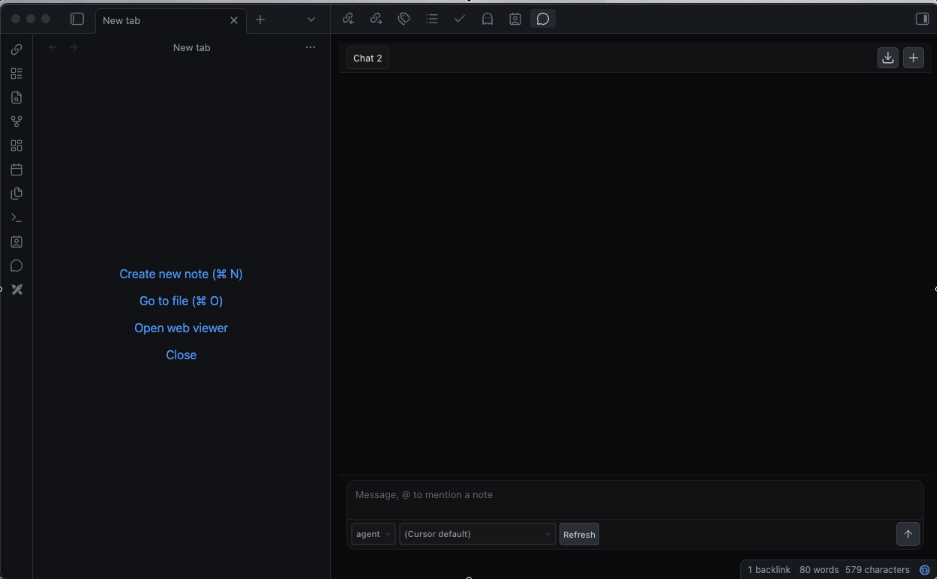
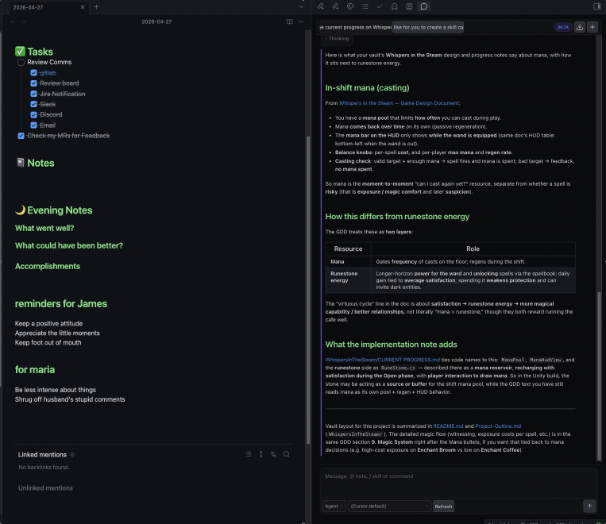

# Cursor Agent (Obsidian plugin)

## NOTE: This plugin is in early development so bugs are sure to be found! Keep this in mind and if you encounter any issues, please let me know here: https://github.com/jspada200/obsidian-cursor-plugin/issues 🙏

<p align="center">
  
</p>


This plugin is aimed at **[Cursor](https://cursor.com) subscribers** who already use Cursor and want the **same vault-scoped assistant inside [Obsidian](https://obsidian.md)**—so your notes stay in Obsidian while the **Cursor CLI** (`agent`) runs against the vault root as its workspace.

It connects Obsidian to Cursor’s Agent through **ACP** (stdio JSON-RPC): **Ask**, **Plan**, and **Agent** modes, streaming replies, permission prompts when tools run, and optional plan / multiple-choice dialogs when the Agent requests them.

## What you get

- **Vault as workspace** — Every session uses your Obsidian vault folder as `--workspace`, so paths and edits line up with your notes.
- **Session tabs** — Multiple chats; tab metadata can persist across restarts (message history is kept in memory for the current session).
- **Context** — Each send can include open tabs, outbound links from the active note, and paths you `@`-mention (search by path/name or `#tag`).
- **Slash skills & commands** — Type `/` in the chat box for a Cursor-style menu (**Skills** from `<Vault>/.cursor/skills` and `~/.cursor/skills`, plus optional extra scan dirs in settings; **Commands** from a curated list). Arrow keys and Enter select; Esc closes. Skills outside the vault are inlined into the prompt so the agent can follow them.
- **Slash in a markdown note** — In any **`.md`** note (Source or Live Preview), type `/` at the start of a line or after whitespace; the same skills/commands list appears. Picking one inserts a normal markdown link like `[▶ /create-skill](obsidian://cursoragent?…)` so it stays **clickable** in Live Preview and Reading (raw `<cursor-agent>` HTML often shows as a code block).
- **Run from a note** — Click that link (or the legacy **Run** control if you still use `<cursor-agent>…</cursor-agent>`). Obsidian opens the `cursoragent` URI, the plugin opens a new chat tab, and sends the skill/command with the note as context.
- **Modes & model** — Dropdowns for mode (agent / plan / ask) and model. Models are loaded by running **`agent models`** (fallback: **`agent --list-models`**); each option stores only the **model id** (the part before ` - `), which is what gets passed as **`--model`** to the CLI.
- **Agent log file** — Optional append-only **`cursor-agent.log`** next to the plugin (spawn command, ACP RPC summaries, stderr, session/update stream events). Toggle under **Settings → Cursor Agent → Diagnostics log**. Command palette: **Reveal Cursor Agent log file**.

Log path: `<Vault>/.obsidian/plugins/obsidian-cursor-plugin/cursor-agent.log` (same folder as `main.js`). Large logs rotate automatically.

## Skills

Skills are the same **Agent Skill** pattern Cursor uses: each skill is a **`SKILL.md`** file (often with YAML frontmatter such as `name` and `description`). The plugin discovers them, shows them next to **Commands** in the `/` picker, and can run them from the chat or from a note with the note as context.

<p align="center">
  
</p>

### Where skills are loaded from

1. **Inside your vault** — Any `SKILL.md` under **`<Vault>/.cursor/skills/`** (nested folders are fine, same layout as Cursor).
2. **Your user Cursor folder** — **`~/.cursor/skills`** on the machine where Obsidian runs (desktop only).
3. **Extra roots (optional)** — **Settings → Cursor Agent → Extra skill scan directories**: one absolute path per line; each tree is scanned for `SKILL.md` the same way.

Saving plugin settings refreshes the cached catalog so new or moved skills show up after a moment.

### In the Cursor Agent panel

Type **`/`** in the message box (after whitespace or at the start of the line). You get **Skills** and **Commands** sections, filtering as you type. **Enter** selects a row; **Esc** closes the menu. Choosing a **skill** sends instructions (and for vault skills, an `@` path; for skills outside the vault, the skill body is inlined so the agent can still follow them).

### In markdown notes

In a **`.md`** file, type **`/`** the same way (start of line or after whitespace). The editor suggest list matches the chat menu. Picking an item inserts a markdown link **`[▶ /…](obsidian://cursoragent?…)`** that stays clickable in **Live Preview** and **Reading**; clicking it opens a **new chat tab** and runs that skill or command with **the note you were in** as context.

You can still use legacy inline HTML **`<cursor-agent>…</cursor-agent>`** if you prefer; when Obsidian renders it as an element, the plugin shows a **Run** button there too.

### Commands

**Commands** in the `/` menu are a **curated** list of common slash-style invocations (the desktop Cursor app is not queried live). They are sent as plain `/…` text to the agent like any other message.


## Like what I am doing?

<a href="https://www.buymeacoffee.com/spadjv" target="_blank"></a>

## Requirements

- **Obsidian** desktop (this plugin is **desktop-only**; see `manifest.json`).
- **Cursor Agent CLI** installed and on your `PATH`, or configured in plugin settings (default install location is often `~/.local/bin/agent`).
- A **Cursor account / subscription** that includes access to **Cursor Agent via the CLI** — authenticate once with `agent login` (see [Cursor CLI docs](https://cursor.com/docs/cli)).

Exact CLI availability and pricing are defined by Cursor; if `agent` cannot log in or run models, check your Cursor account and CLI status first.

## Install the plugin (BRAT, pre–marketplace)

**This plugin is not in the official Obsidian community plugin catalog yet.** If you want to try it before it is published to the marketplace, use **[BRAT](https://github.com/TfTHacker/obsidian42-brat)** (Beta Reviewer’s Auto-update Tool) to install and update it from this repository.

1. In Obsidian: **Settings → Community plugins** — turn off **Restricted mode** if needed, then **Browse** and install **BRAT** (published as *Obsidian42 - BRAT* or similar). Enable the plugin.
2. Open **Settings → Obsidian42 - BRAT** (or **BRAT**).
3. Use **Add Beta plugin** (wording may vary slightly by version) and enter this GitHub URL:

   `https://github.com/jspada200/obsidian-cursor-plugin`

4. After BRAT finishes, enable **Cursor Agent** under **Settings → Community plugins** (and complete [User setup](#user-setup) below: CLI, `agent login`, and plugin options).

BRAT will track GitHub **Releases** for updates when new versions are published.

## User setup

1. Install the Cursor CLI using Cursor’s installation instructions (`curl … | bash` or their current installer).
2. In a terminal, run **`agent login`** and complete authentication.
3. Confirm the binary exists, e.g. `~/.local/bin/agent` or `which agent`.

Manual installation:

1. Copy or symlink this plugin folder into your vault:

   `<Vault>/.obsidian/plugins/obsidian-cursor-plugin/`

   That folder must contain at least **`main.js`**, **`manifest.json`**, and **`styles.css`** (build first; see below).

2. In Obsidian: **Settings → Community plugins → Safe mode off** → enable **Cursor Agent**.

3. Optional: **Settings → Cursor Agent** — set binary path, defaults, trust (`--trust`), context toggles, and whether to write **`cursor-agent.log`** for debugging.

Open the chat from the ribbon (**message** icon) or the command palette: **Open Cursor Agent chat**.

## Development setup

```bash
git clone <repository-url>
cd obsidian-cursor-plugin
npm install
```

- **Production build** (minified `main.js`):

  ```bash
  npm run build
  ```

- **Watch mode** (rebuild on change while you hack):

  ```bash
  npm run dev
  ```

Point Obsidian at this folder under `.obsidian/plugins/obsidian-cursor-plugin/` (symlink is fine). Reload Obsidian after builds when not using watch.

Typecheck only:

```bash
npx tsc -noEmit -skipLibCheck
```

## Troubleshooting

- **Windows — default path and `agent.cmd`** — If you leave **Agent binary path** empty, the plugin uses `%LOCALAPPDATA%\cursor-agent\agent.cmd` (the usual Cursor CLI shim on Windows), not `~/.local/bin/agent`. If you set the path yourself, use the full path to `agent.cmd` (or another real executable). On recent Node.js versions, `.cmd` / `.bat` / `.ps1` shims must be launched with a shell; the plugin does that automatically for those extensions.
- **`agent: command not found` in Terminal** — The installer often puts the binary at `~/.local/bin/agent`, which may not be on your shell `PATH`. Either add that directory to `PATH` in `~/.zshrc`, or log in with the full path:  
  `~/.local/bin/agent login`  
  In the plugin, set **Agent binary path** to that full path (the default is already `~/.local/bin/agent` expanded to an absolute path, which does **not** rely on `PATH`).
- **`agent` not found / ENOENT from the plugin** — Confirm the file exists and is executable; use **Settings → Cursor Agent → Verify binary**. Rebuild after changing the path.
- **Auth / subscription errors** — Run `~/.local/bin/agent login` (or your installed path). Use non-interactive auth only if Cursor documents it for your account.
- **“ACP” / JSON-RPC errors** — Open **Developer Tools** and check the console for `[Cursor Agent]` and `[cursor-agent stderr]`. Error notices now include recent CLI stderr when available.
- **Sessions after restart** — Persisted tab rows may reference old server session IDs; sending a message may create a new session if the CLI process restarted.


## Current limitations
- No plan mode
- Slow startup time: takes a few seconds to start up to agent executable. Trying to mitagate it but no luck yet!
- No multiple-choice dialogs when context needs refinement

## License

MIT (see `package.json`).
